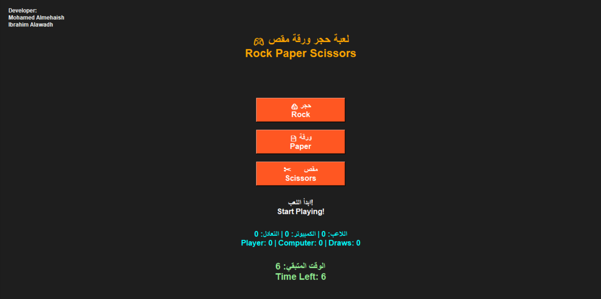

# Rock Paper Scissors Game 🎮

A bilingual Rock Paper Scissors desktop game developed using Python and Tkinter.

This project was created mainly for learning, practicing, and improving programming skills through real implementation rather than only building a small game.

---

# Features

- Arabic and English interface
- Rock, Paper, and Scissors gameplay
- Countdown timer system
- Score tracking system
- Draw counter
- Computer automatic choice
- Simple modern GUI
- Executable (.exe) version included

---

# Technologies Used

- Python
- Tkinter
- PyInstaller

---

# Project Goal

The main goal of this project is to practice Python programming, GUI development, logical thinking, and software implementation using real coding experience.

The project focuses more on learning and applying concepts than creating a complex commercial game.

---

# Screenshots

## Main Interface


## Timer Feature


## Score System


## Game Result


---

# How to Run

## Python Version

Run the Python file:

```bash
python Game_Arabic-English.py
```

## Executable Version

Open:

```text
Game_Arabic-English.exe
```

---

# Files Included

- Python source code
- Executable game file
- Project report PDF
- Screenshots

---

# Author

Mohamed Abdullah Almehaish
